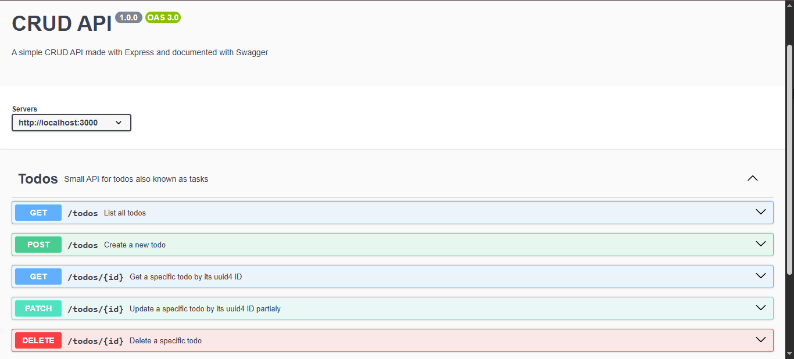

# CRUD API — Todo List

A small Express.js CRUD API built as part of my 8-week portfolio track. Backend AI Engineer Intern project focused on REST fundamentals, route architecture, and API documentation.

## Stack

- Node.js + Express 5
- pnpm
- swagger-jsdoc + swagger-ui-express (interactive API docs)
- uuid -> for auto-generating todo IDs
- nodemon -> to automaticaaly restart the server without manual restarts

## Project Structure

```text
CRUD-API/
├── api.js              # Express app instance, middleware, route mounting
├── server.js           # Entry point -> imports app, calls app.listen()
├── routes/
│   └── todos.js        # Router for all /todos endpoints
├── package.json
```

**Why the split?** `api.js` builds the app (middleware + routes); `server.js` only starts it. This keeps `app` importable in tests without spinning up a live server.

## Endpoints

| Method | Path          | Description                   |
|--------|---------------|-------------------------------|
| GET    | `/todos`      | List all todos                |
| POST   | `/todos`      | Create a new todo             |
| GET    | `/todos/:id`  | View a specific todo          |
| PATCH  | `/todos/:id`  | Update an existing todo       |
| DELETE | `/todos/:id`  | Delete a todo                 |
| GET    | `/health`     | Server health check           |

Todos are stored in an in-memory mock array.

## API Docs (Swagger UI)

Interactive docs are served at:

```bash
http://localhost:3000/docs
```

Generated via `swagger-jsdoc` from inline JSDoc comments in `routes/todos.js`. Full CRUD cycle (create -> list -> update -> delete) can be run directly from the "Try it out" UI, no curl needed.

## SwaggerUI Screenshot



## Getting Started

```bash
pnpm install
pnpm start   # or: node server.js
```

Server runs on `http://localhost:3000` by default (override with `PORT` env var).

## Notes / Learnings

- Route mounting gotcha: mounting a router at `/todos` and then defining routes inside that router as `/todos` again produces `/todos/todos`. Router paths should be relative to the mount point (e.g. `/` or `/:id`).
- `const` prevents reassigning a variable, not mutating its contents – array methods like `.push()` work fine on a `const` array; `.filter()` reassignment does not.
- Health checks belong at the app level (`api.js`), not inside a resource-scoped router — they're not "about" any one resource.
- These are mistakes I made during this build and managed to resolve them with personalised Claude walkthrough.

## Author

Andries — Backend AI Engineer Intern @ FlyRank, CS50 AI student.