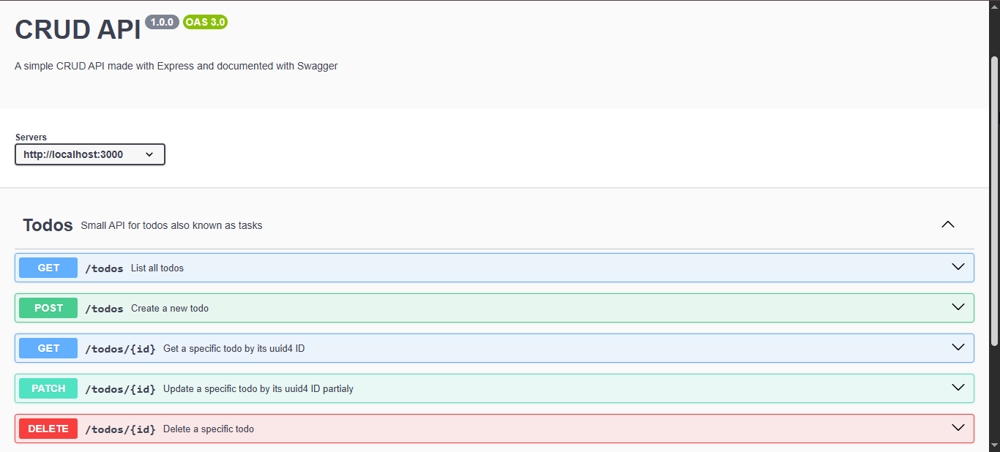
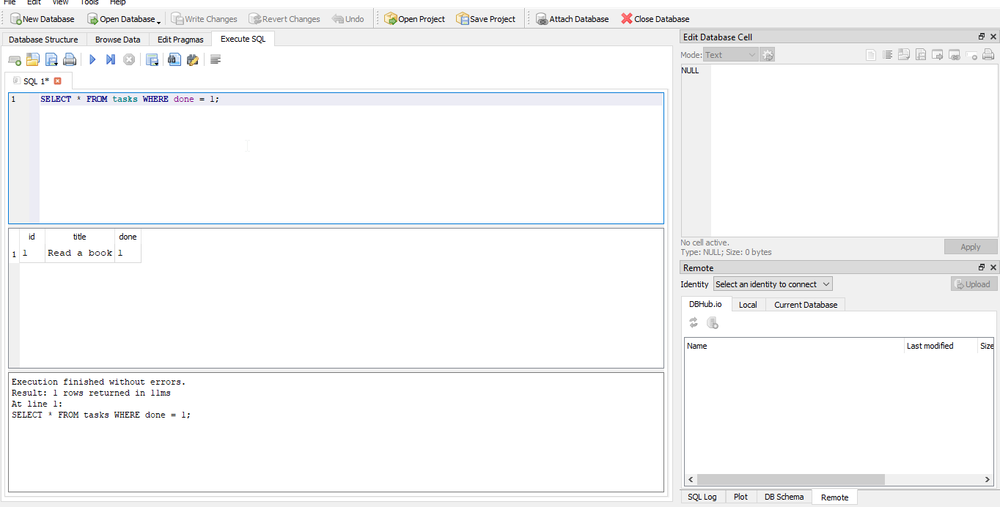

# CRUD API — Todo List

A small Express.js CRUD API built as part of my 8-week portfolio track. Backend AI Engineer Intern project focused on REST fundamentals, route architecture, repository pattern, and containerized deployments.

## Stack

- Node.js + Express 5
- pnpm
- PostgreSQL + `pg` (node-postgres) -> replacing `better-sqlite3`
- Docker + Docker Compose
- swagger-jsdoc + swagger-ui-express (interactive API docs)
- nodemon → to automatically restart the server without manual restarts

## Project Structure

```text
CRUD-API/
├── api.js                  # Express app instance, middleware, route mounting
├── server.js               # Entry point → imports app, calls app.listen()
├── db/
│   └── pool.js             # pg connection pool (reads from DATABASE_URL)
├── repository/
│   └── todoRepository.js   # All SQL queries (getAllTodos, getTodoById, createTodo, updateTodo, deleteTodo)
├── routes/
│   └── todos.js            # Router for all /todos endpoints
├── init.sql                # Schema definition — runs once on Postgres container init
├── docker-compose.yml      # api + db services, volume, networking
├── .env                    # DATABASE_URL and PORT (not committed)
├── package.json
```

**Why the split?** `api.js` builds the app (middleware + routes); `server.js` only starts it. This keeps `app` importable in tests without spinning up a live server.

**Why a repository layer?** Routes call repo functions (`getAllTodos`, `createTodo`, etc.) directly — no service layer yet since the app logic doesn't warrant one. The repo layer keeps SQL out of the route handlers and makes the DB swappable without touching routes.

## Endpoints

| Method | Path          | Description                                               |
|--------|---------------|-----------------------------------------------------------|
| GET    | `/todos`      | List all todos (supports `?search=` and `?done=` filters) |
| POST   | `/todos`      | Create a new todo                                         |
| GET    | `/todos/:id`  | View a specific todo                                      |
| PATCH  | `/todos/:id`  | Update an existing todo                                   |
| DELETE | `/todos/:id`  | Delete a todo                                             |
| GET    | `/health`     | Server health check                                       |

## API Docs (Swagger UI)

Interactive docs are served at:

```bash
http://localhost:3000/docs
```

Generated via `swagger-jsdoc` from inline JSDoc comments in `routes/todos.js`. Full CRUD cycle (create → list → update → delete) can be run directly from the "Try it out" UI, no curl needed.

## Screenshots





## Database

PostgreSQL, running as a Docker service. Schema is initialized via `init.sql` mounted to `/docker-entrypoint-initdb.d/` — runs automatically on first container start with a fresh volume.

```sql
CREATE TABLE IF NOT EXISTS tasks (
    id INTEGER PRIMARY KEY GENERATED BY DEFAULT AS IDENTITY,
    title TEXT NOT NULL,
    done BOOLEAN NOT NULL DEFAULT FALSE,
    created_at TIMESTAMP DEFAULT NOW(),
    updated_at TIMESTAMP DEFAULT NOW()
);
```

Data persists across full `docker compose down/up` cycles via a named Docker volume.

## Getting Started

### With Docker (recommended)

```bash
cp .env.example .env        # set DATABASE_URL and PORT
docker compose up --build
```

API runs at `http://localhost:3000`.

### Without Docker (local Postgres required)

```bash
pnpm install
# set DATABASE_URL in .env to point at your local Postgres instance
pnpm start
```

## Environment Variables

| Variable       | Description                          | Example                                          |
|----------------|--------------------------------------|--------------------------------------------------|
| `DATABASE_URL` | Postgres connection string           | `postgresql://user:pass@db:5432/tododb`          |
| `PORT`         | Port the API listens on              | `3000`                                           |

## Example Queries

```bash
# Get all todos
curl http://localhost:3000/todos

# Filter by search term and status
curl "http://localhost:3000/todos?search=groceries&done=false"

# Create a todo
curl -X POST http://localhost:3000/todos \
  -H "Content-Type: application/json" \
  -d '{"title": "Buy groceries"}'

# Update a todo
curl -X PATCH http://localhost:3000/todos/1 \
  -H "Content-Type: application/json" \
  -d '{"title": "Buy groceries at the mall", "done": true}'

# Delete a todo
curl -X DELETE http://localhost:3000/todos/1
```

## Notes / Learnings

- Route mounting gotcha: mounting a router at `/todos` and then defining routes inside as `/todos` again produces `/todos/todos`. Router paths should be relative to the mount point.
- `const` prevents reassigning a variable, not mutating its contents — `.push()` works fine on a `const` array; `.filter()` reassignment does not.
- Health checks belong at the app level (`api.js`), not inside a resource-scoped router.
- Postgres uses positional placeholders (`$1, $2`) unlike SQLite's `?` — and placeholder numbers must be derived dynamically when building conditional queries, e.g. `$${params.length}` after each push.
- `DEFAULT FALSE` on a `BOOLEAN` column only fires when the column is omitted from the `INSERT` entirely — passing `null` explicitly still violates `NOT NULL`. Dynamic column building in the repo handles this correctly.
- Docker's `init.sql` only runs on a **fresh volume** — editing the schema requires wiping the volume (`docker compose down -v`) and reinitializing.
- `EAI_AGAIN db` errors mean the API container can't resolve the DB service hostname — always verify `DATABASE_URL` in `.env` matches the service name in `docker-compose.yml`.
- These are mistakes I made during this build and resolved with a personalised Claude walkthrough.

## Author

Andries — Backend AI Engineer Intern @ FlyRank, CS50 AI student.